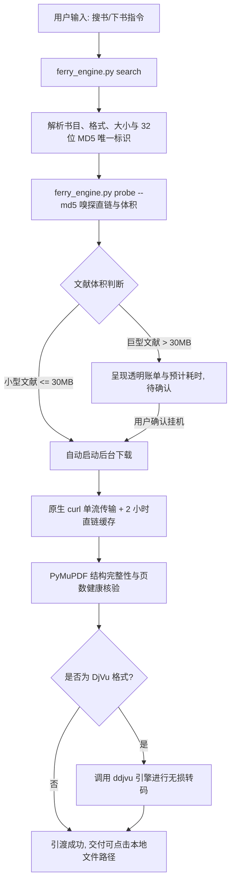

<div align="center">

# 🚢 安娜书渡 (Anna's Archive Ferry)

**数千万册中外文献、学术古籍、电子图书的全自动检索、智能消歧与静默引渡引擎**

[](LICENSE)
[](https://www.python.org/)
[](SKILL.md)
[](https://github.com/ATP24/annas-archive-ferry)
[](https://github.com/ATP24/annas-archive-ferry)

[English Documentation](README_EN.md) · [技能使用规范 (SKILL.md)](SKILL.md) · [报告问题](https://github.com/ATP24/annas-archive-ferry/issues)

</div>

---

## 📖 项目简介

**「安娜书渡」(Anna's Archive Ferry)** 是专为 AI Agent（Google Antigravity、Claude Code、Cursor、OpenAI Agents）以及个人研究者打造的安娜档案（Anna's Archive）图书检索与自动化下载套件。

针对文献下载过程中频繁遇到的**DDoS 防护阻拦、多域名跳转死循环、慢速通道排队倒计时、超大文献盲目下载耗尽 Agent 上下文 Token**等痛点，「安娜书渡」提供了一整套标准化的工程解决方案：
- 🔍 **智能检索消歧**：毫秒级抓取多版本格式（PDF/DjVu/EPUB）、体积与元数据。
- 🧭 **前置决策探针 (Probe)**：下载前先嗅探直链体积与耗时，透明呈现决策账单。
- ⚡ **本地神经网络打码**：内置离线 ddddocr 模型，本地破解 DDoS-Guard 验证码，无需付费打码平台。
- 🌊 **系统原生单流下载**：利用系统级 curl 单流拉取，严格处理 HTTP 206 断点与 200 覆盖，绝不污染数据。
- 🍃 **零 Token 静默挂机**：专为 Agent 优化，长时任务异步通知，彻底告别轮询带来的 Token 浪费。

---

## 🏗️ 架构与引渡流程



---

## ✨ 核心特性

| 功能特性 | 传统直接拉取 / 普通脚本 | 🚢 安娜书渡 (Anna's Archive Ferry) |
| :--- | :--- | :--- |
| **镜像稳定性** | 频繁在不同镜像间跳转，Cookie 丢失导致死循环 | **单一主镜像锁定机制**，配合 GitHub Pages 官方信标自动恢复 |
| **下载前决策** | 盲目直接启动下载，下载到一半发现几百兆超时挂掉 | **前置嗅探 (Probe)**，先知晓精确大小、限速与耗时 |
| **人机验证绕过** | 遇到安全防护页面卡死中断 | **本地离线神经网络 (ddddocr)** 毫秒级识别通过 |
| **Agent Token 消耗** | 轮询状态导致数万上下文 Token 迅速耗尽 | **零 Token 挂机规范**，完全依赖系统异步回调唤醒 |
| **下载完整性保障** | 误拼 HTTP 200/206 导致文件头损坏 | **严格区分响应状态码**，配合 PyMuPDF 真实开卷验真 |
| **开箱可用性** | 繁琐的环境配置与依赖编译 | 提供 **Windows 一键批处理** 与跨平台标准 CLI |

---

## 🚀 快速上手

### 方式一：作为 Agent 技能直接集成（推荐）

本仓库原生遵循 **Agent Skill Specification**。

1. 克隆或下载本仓库到你所使用 Agent 的技能目录：
   ```bash
   # 例如 Antigravity 全局技能路径
   git clone https://github.com/ATP24/annas-archive-ferry.git "C:\Users\<YourUsername>\.gemini\config\skills\annas-archive-ferry"
   ```
2. 安装环境依赖：
   ```bash
   cd annas-archive-ferry
   pip install -r scripts/requirements.txt
   ```
3. 在与 Agent 对话时直接提出搜书诉求：
   > *"帮我搜索并下载《赵万里文集》第一卷的 PDF"*
   
   Agent 将自动读取 `SKILL.md`，执行检索、嗅探账单并在后台静默下载。

---

### 方式二：终端命令行独立使用 (CLI)

#### 1. 环境依赖安装
```bash
pip install -r scripts/requirements.txt
```

#### 2. 环境健康自检 (Doctor)
检测本机 Python 环境、系统原生浏览器、代理配置及主站连通性：
```bash
python scripts/ferry_engine.py doctor
```

#### 3. 检索图书 (Search)
```bash
# 基本搜索
python scripts/ferry_engine.py search "史记" --limit 5

# 指定格式搜索 (pdf / djvu / epub)
python scripts/ferry_engine.py search "敦煌遗书" --ext pdf --limit 5

# 输出 JSON 供程序脚本调用
python scripts/ferry_engine.py search "王羲之" --json
```

#### 4. 前置嗅探与账单决策 (Probe)
在下载前获取书籍精确字节大小、限速带宽预估及耗时：
```bash
python scripts/ferry_engine.py probe --md5 <目标书籍MD5>
```

#### 5. 纯净单流下载 (Download)
```bash
# 基础下载（自动使用 probe 阶段缓存的 CDN 直链）
python scripts/ferry_engine.py download --md5 <目标书籍MD5>

# 自定义保存路径与文件名
python scripts/ferry_engine.py download --md5 <目标书籍MD5> --output "~/Books" --name "史记中华书局版"

# 静默挂机下载（无冗余输出，适合后台服务）
python scripts/ferry_engine.py download --md5 <目标书籍MD5> --quiet
```

---

### 方式三：Windows 用户双击即用

- **一键配置环境.bat**：双击自动检测 Python、一键拉取清华源依赖并执行自检。
- **启动安娜书渡.bat**：带交互式中文菜单的控制台，支持搜书、MD5 极速下载及一键打开下载文件夹。

---

## ⚙️ 配置文件说明 (`scripts/config.json`)

```json
{
  "primary_mirror": "https://zh.annas-archive.gl",
  "official_fallbacks": [
    "https://annas-archive.gl",
    "https://annas-archive.pk",
    "https://annas-archive.gd"
  ],
  "beacons": [
    "https://shadowlibraries.github.io/DirectDownloads/AnnasArchive/",
    "https://open-slum.pages.dev/"
  ],
  "heavy_threshold_mb": 30,
  "proxy": "auto",
  "default_download_dir": "~/Downloads/AnnasFerry",
  "default_format": "pdf",
  "auto_convert_djvu": true,
  "timeout_seconds": 180,
  "headless": true
}
```

- `primary_mirror`：锁定主镜像地址，防止多镜像漂移。
- `beacons`：官方存活镜像信标发布页（主站失效时自动探针恢复）。
- `heavy_threshold_mb`：大文件拦截阈值（默认 30MB，超过需确认后挂机）。
- `proxy`：代理配置（`"auto"` 自动扫描系统环境变量与 7890/10808 等主流端口）。
- `default_download_dir`：默认书籍落盘目录，支持 `~` 自动跨平台解析。

---

## 🛡️ Agent 交互四大铁律

为保证在各类 AI Agent 中的最佳运行实践，本工具固化了以下铁律：
1. **先探后下（Strict Probe First）**：严禁未经嗅探盲目下载，超 30MB 文献必须先出具透明账单。
2. **零 Token 挂机（Zero-Token Daemon）**：长时下载交由系统异步管理，禁止任何高频循环轮询（Polling）。
3. **输出净化（Clean Stdout）**：严禁向 Agent 上下文回传原始 HTML DOM 或数千行流式日志。
4. **状态码合规（RFC 7233）**：严格校验 `206 Partial Content`，严禁在 `200 OK` 下强行断点追加。

---

## 🤝 参与贡献

欢迎提交 Issue 和 Pull Request！详细规范请参阅 [CONTRIBUTING.md](CONTRIBUTING.md)。

1. Fork 本仓库并新建分支：`git checkout -b feat/my-feature`
2. 提交修改并书写清晰的 Commit 信息：`git commit -m "feat: add support for epub metadata extraction"`
3. 推送分支并提交 PR：`git push origin feat/my-feature`

---

## 📜 开源许可

本项目基于 [MIT License](LICENSE) 协议开源。请遵循当地法律法规与版权政策合理使用。
