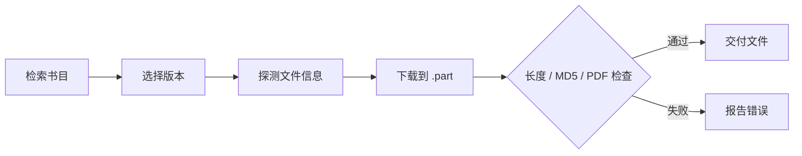

# 安娜书渡 · Anna's Archive Ferry

**为 Agent 和命令行设计的本地文献检索与校验下载工具。**

在 Anna's Archive 查找书目、比较版本、探测文件大小，再由你选择要保存的文件。下载过程支持断点续传；完成后核对书目 MD5，并检查 PDF 是否可打开。

[English](README_EN.md) · [Skill 指令](SKILL.md) · [CLI 参考](docs/cli.md) · [排障](docs/troubleshooting.md)

[](https://github.com/ATP24/annas-archive-ferry/actions/workflows/ci.yml) [](pyproject.toml) [](LICENSE)


> **项目定位**：这是运行在你电脑上的 Agent Skill 与 Python CLI。它使用网站公开页面和下载通道，不是 Anna's Archive 的官方客户端；网站结构、镜像和访问挑战变化时，功能可能中断。请仅获取你有权访问的资料。

## 它如何工作

| 步骤 | 你得到什么 | 命令 |
| --- | --- | --- |
| 检索 | 书名、格式、来源信息和书目 MD5，供你比较版本 | `search` |
| 探测 | 解析下载链接和服务器报告的文件大小；不额外下载样本 | `probe` |
| 下载 | 实际传输速度与剩余时间、续传、完整性检查 | `download` |



下载是**同步运行**的。`probe` 不会猜测耗时；开始下载后才依据真实传输速度更新剩余时间。速度和剩余时间都可能波动。

## 快速开始

需要 **Python 3.9+**。检索与解析链接还需要 Chrome、Edge 或 Playwright Chromium；DjVu 转 PDF 需要另外安装 `ddjvu`。

```bash
git clone https://github.com/ATP24/annas-archive-ferry.git
cd annas-archive-ferry
python -m venv .venv
```

激活虚拟环境：Windows PowerShell 用 `.venv\Scripts\Activate.ps1`；macOS/Linux 用 `source .venv/bin/activate`。然后在同一终端执行：

```bash
python -m pip install -e .
python -m playwright install chromium
annas-ferry doctor
```

若已安装兼容的 Chrome 或 Edge，通常可跳过 Chromium 安装。首次自检会访问站点，因此需要可用的网络连接。

选择书目后，将检索结果中**完整的 32 位 MD5**代入后两条命令：

```bash
annas-ferry search "Pride and Prejudice Jane Austen" --ext epub --limit 5 --json
annas-ferry probe --md5 <MD5> --json
annas-ferry download --md5 <MD5> --output "./downloads"
```

`--json` 的标准输出只包含 JSON；进度与诊断信息写入标准错误输出，便于 Agent 或程序解析。所有参数见 [CLI 参考](docs/cli.md)。

## 用作 Agent Skill

把整个仓库放入你的 Agent 支持的 skills 目录，确保 `SKILL.md` 位于该技能目录顶层，并在同一环境安装上面的 Python 依赖。随后可以说：“在 Anna's Archive 找《傲慢与偏见》的 EPUB，列出版本，先不要下载。”

Agent 的技能发现方式、命令执行权限和安装目录由其自身决定；请查看对应 Agent 文档。本项目的 [SKILL.md](SKILL.md) 只规定何时检索、如何让用户选版，以及何时交付文件。

## 下载与验证边界

- 有书目 MD5 时，下载后会核对文件内容；PDF 还会检查能否打开及页数。其他格式目前主要依赖 MD5，不代表语义或排版质量检查。
- 下载先写入 `.part`，并用 `.part.meta` 记录资源身份。只有服务器正确支持字节范围时才续传；检查通过后才生成最终文件。
- `--direct-url` 只接受公网 HTTPS。没有 MD5 时，服务器必须提供可核对的长度；这比内容哈希校验弱。
- 页面结构、验证码、镜像或 CDN 可能变化。未取得直链、校验失败或访问受限时，工具会报错，不保证每本书都可下载。
- `doctor --fix` 会安装 Python 包；请明确决定是否运行。使用者需遵守所在地法律和资料的访问权限。

## 文档与项目状态

- [CLI 参数与配置](docs/cli.md) · [常见问题与排障](docs/troubleshooting.md) · [真实站点验证记录](docs/verification.md)
- [贡献指南](CONTRIBUTING.md) · [报告问题](https://github.com/ATP24/annas-archive-ferry/issues/new/choose) · [安全问题](SECURITY.md) · [MIT 许可证](LICENSE)

项目仍处于 **Beta**。自动测试覆盖下载校验、续传和 JSON 输出；真实站点验证是一次性记录，不代表未来持续可用。
