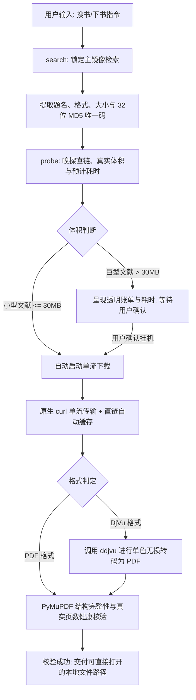

<div align="center">

# 🚢 安娜书渡 (Anna's Archive Ferry)

**数千万册中外文献、学术专著、古籍古本的全自动检索、智能消歧与静默引渡引擎**

[](https://github.com/ATP24/annas-archive-ferry/actions/workflows/ci.yml)
[](LICENSE)
[](https://www.python.org/)
[](SKILL.md)
[](https://github.com/ATP24/annas-archive-ferry)
[](https://github.com/ATP24/annas-archive-ferry)

[English Documentation](README_EN.md) · [Agent 技能规范 (SKILL.md)](SKILL.md) · [报告问题](https://github.com/ATP24/annas-archive-ferry/issues)

</div>

---

## 📖 项目简介

**「安娜书渡」(Anna's Archive Ferry)** 是专为 **AI Agent（Google Antigravity、Claude Code、Cursor、OpenAI Codex 等）** 以及学术研究人员设计的安娜档案（Anna's Archive）图书检索与自动化引渡套件。

针对海量文献获取过程中常见的**DDoS 安全挑战、多域名重定向循环、慢速通道排队倒计时、超大文献盲目下载耗尽 Agent 上下文 Token**等核心痛点，「安娜书渡」提供了一整套标准化的工程解决方案：

- 🔍 **智能多源检索与版本消歧**：结构化抓取多格式（PDF / DjVu / EPUB / MOBI）、文件大小与文献元数据。
- 🧭 **前置决策探针 (Probe-First)**：下载前嗅探直链真实大小、限速带宽与耗时，输出透明账单，提供挂机决策窗口。
- ⚡ **本地神经网络离线打码**：内置离线 `ddddocr` 深度学习模型，毫秒级通关 DDoS-Guard 图形验证码，0 额外商用打码开销。
- 🔄 **单一主站锁定与信标自愈**：主镜像锁定机制阻断域名漂移，并在主站受阻时通过 GitHub Pages 官方信标自动发现并无缝故障转移。
- 🌊 **纯净单流下载与断点续传**：优先调用系统原生 `curl` 单流传输，严格遵循 RFC 7233 协议（区分 HTTP `206` 与 `200`），杜绝文件头拼接损坏。
- 📄 **DjVu 无损转码与真实开卷验真**：集成 `ddjvu` 转码管道与 `PyMuPDF` 文档健康核验，杜绝空壳损坏文件交付。
- 🍃 **零 Token 异步静默挂机 (Zero-Token Daemon)**：专为 Agent 优化，长耗时下载完全依赖操作系统后台异步事件唤醒，彻底告别轮询带来的 Token 浪费。

---

## 🏗️ 架构与引渡流程



---

## ✨ 核心特性矩阵

| 功能特性 | 传统直接拉取 / 普通脚本 | 🚢 安娜书渡 (Anna's Archive Ferry) |
| :--- | :--- | :--- |
| **镜像稳定性** | 频繁在不同镜像间跳转，导致 Cookie 丢失与死循环 | **单一主镜像锁定机制**，配合官方 GitHub 信标自动探针恢复 |
| **下载前决策** | 盲目直接启动下载，下载到一半超时挂死 | **前置嗅探 (Probe-First)**，预先呈现精确字节、限速 QoS 与预计耗时 |
| **人机验证绕过** | 遇到安全防护页面卡死中断，需人工接管 | **本地离线神经网络 (ddddocr)** 毫秒级自动通关 |
| **Agent Token 消耗** | 循环轮询任务状态，数十万上下文 Token 迅速耗尽 | **零 Token 挂机规范 (Zero-Token Daemon)**，长任务完全交由异步事件唤醒 |
| **数据完整性保障** | 错误追加 HTTP 200 数据导致文件头损坏 | **严格校验 RFC 7233 状态码**，配合 PyMuPDF 真实开卷验真 |
| **DjVu 格式支持** | 仅下载原始 .djvu 文件或粗暴重命名为 .pdf | **原生挂载 ddjvu 转码管道**，全自动无损转换为通用 PDF |
| **跨平台适配** | 仅适配特定操作系统环境 | 提供 **跨平台 Python CLI**、**Windows 批处理** 与 **macOS/Linux Shell 脚本** |

---

## 🚀 快速上手

### 方式一：作为 Agent 技能无缝集成（推荐）

本仓库原生遵循 **Agent Skill Specification**。

1. 将本仓库克隆至您 Agent 的技能目录中：
   ```bash
   git clone https://github.com/ATP24/annas-archive-ferry.git "<path-to-your-skills>/annas-archive-ferry"
   ```
2. 安装环境依赖：
   ```bash
   cd annas-archive-ferry
   pip install -r requirements.txt
   ```
3. 在与 AI Agent（Antigravity / Claude Code 等）对话时直接提出搜书需求：
   > *"帮我搜索并下载《赵万里文集》第一卷的 PDF"*

   Agent 会自动读取 `SKILL.md`，执行检索、嗅探账单并在后台静默下载交付。

---

### 方式二：标准 Python 命令行工具 (CLI)

```bash
# 1. 克隆代码仓库
git clone https://github.com/ATP24/annas-archive-ferry.git
cd annas-archive-ferry

# 2. 安装依赖并注册全局命令
pip install -e .

# 3. 执行环境体检
annas-ferry doctor

# 若缺失依赖，可一键自动修复：
annas-ferry doctor --fix
```

#### 常用命令速查

```bash
# 1. 检索图书 (支持关键词、格式限制与条数过滤)
annas-ferry search "史记" --limit 5
annas-ferry search "敦煌遗书" --ext pdf --limit 5
annas-ferry search "王羲之" --json

# 2. 前置嗅探与账单决策 (Probe)
annas-ferry probe --md5 <目标书籍MD5>

# 3. 纯净单流下载
annas-ferry download --md5 <目标书籍MD5>
annas-ferry download --md5 <目标书籍MD5> --output "~/Books" --name "史记中华书局版"
annas-ferry download --md5 <目标书籍MD5> --quiet
```

---

### 方式三：终端用户一键启动脚本

- **Windows 用户**：
  - 双击 `一键配置环境.bat`：全自动检查 Python、拉取依赖源并执行自检。
  - 双击 `启动安娜书渡.bat`：进入交互式菜单控制台（搜书、MD5 下载、打开书籍文件夹）。
- **macOS / Linux 用户**：
  ```bash
  chmod +x setup.sh run.sh
  ./setup.sh   # 一键安装环境依赖
  ./run.sh     # 启动交互式控制台
  ```

---

## ⚙️ 配置文件与持久化隔离

系统内置默认配置，并将运行时变更与持久化数据完全隔离于用户主目录 `~/.annas_ferry/` 中，杜绝代码目录被污染：

- **配置文件路径**：`~/.annas_ferry/config.json`
- **临时直链缓存**：`~/.annas_ferry_cache/<md5>.url`

```json
{
  "primary_mirror": "https://zh.annas-archive.gl",
  "official_fallbacks": [
    "https://annas-archive.gl",
    "https://annas-archive.pk",
    "https://annas-archive.gd"
  ],
  "beacons": [
    "https://shadowlibraries.github.io/DirectDownloads/AnnasArchive/",
    "https://open-slum.pages.dev/"
  ],
  "heavy_threshold_mb": 30,
  "proxy": "auto",
  "default_download_dir": "~/Downloads/AnnasFerry",
  "default_format": "pdf",
  "auto_convert_djvu": true,
  "timeout_seconds": 180,
  "headless": true
}
```

---

## 🛡️ Agent 交互四大铁律

在 Agent 环境中使用本技能时，需严格遵循以下规范：
1. **先探后下（Strict Probe-First）**：严禁未经嗅探盲目下载，超 30MB 文献必须先出具透明账单。
2. **零 Token 挂机（Zero-Token Daemon）**：长耗时下载由系统后台异步管理并直接结束回合，严禁在循环中频繁轮询状态。
3. **输出净化（Clean Stdout）**：严禁向 Agent 上下文回传原始 HTML DOM 或数千行流式下载日志。
4. **状态码合规（RFC 7233）**：严格校验 `206 Partial Content`，严禁在 `200 OK` 下强行断点追加损坏文件。

---

## 🤝 参与贡献

欢迎提交 Issue 和 Pull Request！详细规范请参阅 [CONTRIBUTING.md](CONTRIBUTING.md)。

---

## 📜 开源许可

本项目基于 [MIT License](LICENSE) 协议开源。请遵循当地法律法规与版权政策合理合法使用。
