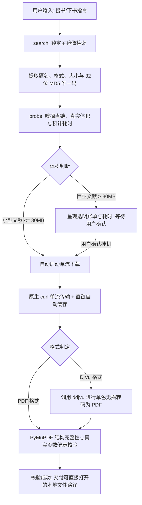

<div align="center">

# 🚢 安娜书渡 (Anna's Archive Ferry)

**数千万册中外文献、学术专著、古籍古本的全自动检索、智能消歧与静默引渡引擎**

[](https://github.com/ATP24/annas-archive-ferry/actions/workflows/ci.yml)
[](https://github.com/ATP24/annas-archive-ferry/releases)
[](LICENSE)
[](https://www.python.org/)
[](SKILL.md)
[](https://github.com/ATP24/annas-archive-ferry)
[](https://github.com/ATP24/annas-archive-ferry/stargazers)
[](https://github.com/psf/black)

[English Documentation](README_EN.md) · [Agent 技能规范 (SKILL.md)](SKILL.md) · [报告问题](https://github.com/ATP24/annas-archive-ferry/issues) · [更新日志 (Releases)](https://github.com/ATP24/annas-archive-ferry/releases)

</div>

---

## 📑 目录 (Table of Contents)

- [📖 项目简介](#-项目简介)
- [🤖 作为 Agent Skill：如何唤醒、交互与使用](#-作为-agent-skill如何唤醒交互与使用)
  - [1. 🎯 自然语言唤醒词与触发指令库](#1--自然语言唤醒词与触发指令库)
  - [2. 💬 真实 Agent 对话交互全流程演示](#2--真实-agent-对话交互全流程演示)
  - [3. 🔌 主流 Agent 生态一键挂载指南](#3--主流-agent-生态一键挂载指南)
  - [4. 🧰 Skill 核心原子能力清单](#4--skill-核心原子能力清单)
- [🏗️ 架构与引渡流程](#️-架构与引渡流程)
- [✨ 核心特性矩阵](#-核心特性矩阵)
- [🚀 开发者进阶：CLI 与 Python SDK](#-开发者进阶cli-与-python-sdk)
  - [方式一：标准 Python 命令行工具 (CLI)](#方式一标准-python-命令行工具-cli)
  - [方式二：Python SDK 编程接口调用](#方式二python-sdk-编程接口调用)
  - [方式三：终端用户一键交互脚本](#方式三终端用户一键交互脚本)
- [⚙️ 配置说明与持久化隔离](#️-配置说明与持久化隔离)
- [🛡️ Agent 交互四大铁律](#️-agent-交互四大铁律)
- [❓ 常见问题与排错指南 (FAQ)](#-常见问题与排错指南-faq)
- [🤝 参与贡献](#-参与贡献)
- [⚖️ 免责声明与合规说明](#️-免责声明与合规说明)
- [📜 开源许可](#-开源许可)

---

## 📖 项目简介

**「安娜书渡」(Anna's Archive Ferry)** 是专为 **AI Agent（Google Antigravity、Claude Code、Cursor、OpenAI Codex 等）** 以及学术研究人员设计的安娜档案（Anna's Archive）图书检索与自动化引渡套件。

针对海量文献获取过程中常见的**DDoS 安全挑战、多域名重定向循环、慢速通道排队倒计时、超大文献盲目下载耗尽 Agent 上下文 Token**等核心痛点，「安娜书渡」提供了一整套标准化的工程解决方案：

- 🔍 **智能多源检索与版本消歧**：结构化抓取多格式（PDF / DjVu / EPUB / MOBI）、文件大小与文献元数据。
- 🧭 **前置决策探针 (Probe-First)**：下载前嗅探直链真实大小、限速带宽与耗时，输出透明账单，提供挂机决策窗口。
- ⚡ **本地神经网络离线打码**：内置离线 `ddddocr` 深度学习模型，毫秒级通关 DDoS-Guard 图形验证码，0 额外商用打码开销。
- 🔄 **单一主站锁定与信标自愈**：主镜像锁定机制阻断域名漂移，并在主站受阻时通过 GitHub Pages 官方信标自动发现并无缝故障转移。
- 🌊 **纯净单流下载与断点续传**：优先调用系统原生 `curl` 单流传输，严格遵循 RFC 7233 协议（区分 HTTP `206` 与 `200`），杜绝文件头拼接损坏。
- 📄 **DjVu 无损转码与真实开卷验真**：集成 `ddjvu` 转码管道与 `PyMuPDF` 文档健康核验，杜绝空壳损坏文件交付。
- 🍃 **零 Token 异步静默挂机 (Zero-Token Daemon)**：专为 Agent 优化，长耗时下载完全依赖操作系统后台异步事件唤醒，彻底告别轮询带来的 Token 浪费。

---

## 🤖 作为 Agent Skill：如何唤醒、交互与使用

本工程的核心第一身份是 **工业级 Agent Skill（智能体技能）**。  
当本技能被接入你的 AI 编程助手或研究 Agent 后，你无需输入任何底层命令行代码，直接用**自然语言对话**即可唤醒全部功能。

### 1. 🎯 自然语言唤醒词与触发指令库

你可以直接在对话框中向 Agent 输入类似以下指令，Agent 会自动感知意图并激活本技能：

| 交互场景 | 推荐的自然语言提示词 (Prompt Examples) | Agent 内部执行逻辑 |
| :--- | :--- | :--- |
| **图书检索与版本比对** | • *“帮我查一下《赵万里文集》在安娜档案有哪些版本？”*<br>• *“搜一下《史记》中华书局版的 PDF，挑个清晰度高的”*<br>• *“看看有没有《资治通鉴》的 EPUB 格式”* | 调用 `search` 引擎，结构化解析各版本格式、体积并输出带 MD5 的对比清单 |
| **前置嗅探与账单决策** | • *“先帮我看看第一卷有多大，下载大概要多久？”*<br>• *“查一下这个 MD5 的直链带宽与体积：`7f9b8c...`”* | 调用 `probe` 前置探针，提取 CDN 字节头并根据限速通道计算预计下载分钟数 |
| **自动化下载与转码** | • *“确认下载第 1 个版本，保存在我的下载目录”*<br>• *“直接帮我下载这个 MD5: `a1b2c3d4...`”*<br>• *“下载完成后如果是 DjVu 格式，记得帮我转成 PDF”* | 调用 `download` 单流引擎，自动执行验证码识别、后台静默拉取与无损转码落盘 |
| **环境自检与依赖自愈** | • *“检查一下安娜书渡的环境是否正常，主站通不通？”*<br>• *“安娜书渡好像缺了依赖库，帮我一键自愈修复”* | 调用 `doctor --fix` 自动诊断原生浏览器、代理配置并自动安装补齐依赖 |

---

### 2. 💬 真实 Agent 对话交互全流程演示

以下是使用 Google Antigravity 或 Claude Code 挂载本技能后的标准交互体验：

```text
👤 User: 
   我想研究赵万里先生的古籍跋尾，帮我在安娜档案搜一下《赵万里文集》，我想下载第一卷。

🤖 Agent (自动激活 annas-archive-ferry 技能):
   正在锁定主镜像检索「赵万里文集」...
   为您找到以下 3 个匹配版本：
   --------------------------------------------------------------------------------
   [01] | PDF  | 42.6 MB  | 赵万里文集 第一卷 标点校勘与学术论文 (中华书局)
        详情: 2008年出版 | 现代排印整理本 | 300 DPI 清晰
        MD5:  7f9b8c3e12a4567890abcdef12345678
   [02] | DJVU | 38.1 MB  | 赵万里文集 第一卷 影印古籍题跋整理初刻本
        详情: 原始文献扫描件 | 单色高对比
        MD5:  8a7b6c5d43e210fedcba098765432101
   [03] | PDF  | 152.0 MB | 赵万里文集 全五卷合订超清全彩影印版
        详情: 超大文献 | 包含附图与稀见拓本
        MD5:  9c8b7a6d5e4f3a2b1c0d9e8f7a6b5c4d
   --------------------------------------------------------------------------------
   推荐选择 [01] 中华书局精校本。正在为您前置嗅探直链体积与通道账单...

   ================================================================================
     【安娜书渡】前置决策与体积账单
   ================================================================================
     书名文件: 赵万里文集_第一卷.pdf
     精确体积: 42.6 MB (44,668,928 字节)
     分块支持: bytes (支持断点续传)
     通道限速: 约 45 ~ 60 KB/s (公众慢速免登录通道 QoS)
     预计耗时: 约 13.8 分钟
   ================================================================================
   ⚠️ 提示：该文件体积超过 30MB 阈值。我将启动后台静默挂机，挂机期间上下文 Token 消耗为 0。是否确认开始下载？

👤 User: 
   确认，开始下载。

🤖 Agent:
   已启动系统原生单流下载引擎。长耗时下载已交由操作系统后台静默管理，期间无需保持等待，您可以继续进行其他研究或代码工作。
   落盘后我将通过 PyMuPDF 真实核验页数并为您呈递可点击的本地文件链接。
   (Agent 立即结束回合，杜绝冗余轮询...)

   ~~~~~~~~~~~~~~~~~~~~~~ 13 分钟后 (系统异步事件通知唤醒 Agent) ~~~~~~~~~~~~~~~~~~~~~~

🤖 Agent:
   🎉 《赵万里文集 第一卷》已成功引渡落盘！
   - 本地路径: file:///C:/Users/username/Downloads/AnnasFerry/赵万里文集_第一卷.pdf
   - 校验结果: 完整无损 (42.6 MB，共 542 页，文档健康)
   您可直接点击上方链接查阅书籍。
```

---

### 3. 🔌 主流 Agent 生态一键挂载指南

本工程支持当前所有主流的 Agent 标准与代码助手：

| AI 智能体平台 | 挂载安装路径 / 方式 | 触发体验 |
| :--- | :--- | :--- |
| **Google Antigravity** | 克隆至 `~/.gemini/config/skills/annas-archive-ferry`，或工作区 `.agents/skills/annas-archive-ferry` | 自动感知。在对话中提到搜书、找古籍、下 PDF 时零配置自动激活 |
| **Claude Code (Anthropic)** | 克隆至 `~/.claude/skills/annas-archive-ferry` | 全自动。Claude Code 启动时自动注入该 Skill，依据 `SKILL.md` 指令运作 |
| **Cursor / Windsurf / Cline** | 放置于工程根目录 `.cursor/skills/` 或 `.agents/skills/` | 在 Agent Composer 中直接自然语言提问或 `@annas-archive-ferry` 触发 |
| **OpenAI Assistants / 自定义 Agent** | 直接调用 `scripts/ferry_engine.py` 并附带 `--json` 参数 | 纯净 JSON 标准输出，任何具备 Function Calling 机制的 Agent 均可 0 门槛调用 |

---

### 4. 🧰 Skill 核心原子能力清单

「安娜书渡」为 Agent 封装了 4 项高内聚的原子能力：

```text
       ┌───────────────────────────────────────────────────────────┐
       │             🚢 安娜书渡 (Anna's Archive Ferry)             │
       └─────────────────────────────┬─────────────────────────────┘
                                     │
     ┌──────────────────┬────────────┴───────┬──────────────────┐
     ▼                  ▼                    ▼                  ▼
【1. 智能搜书】      【2. 前置嗅探】       【3. 静默引渡】      【4. 环境自愈】
  search              probe                download             doctor
 • 多版本消歧        • 嗅探真实字节        • 原生单流拉取       • 宿主浏览器探针
 • 格式/大小解析     • 带宽 QoS 账单      • 离线神经网络打码   • 代理端口自动匹配
 • 结构化 MD5 提取   • 计算预计分钟数     • ddjvu 无损转码     • 缺漏依赖一键安装
 • 支持 JSON 纯净流  • 直链 2小时复用     • PyMuPDF 开卷验真   • 信标主站容灾自愈
```

---

## 🏗️ 架构与引渡流程



---

## ✨ 核心特性矩阵

| 功能特性 | 传统直接拉取 / 普通脚本 | 🚢 安娜书渡 (Anna's Archive Ferry) |
| :--- | :--- | :--- |
| **镜像稳定性** | 频繁在不同镜像间跳转，导致 Cookie 丢失与死循环 | **单一主镜像锁定机制**，配合官方 GitHub 信标自动探针恢复 |
| **下载前决策** | 盲目直接启动下载，下载到一半超时挂死 | **前置嗅探 (Probe-First)**，预先呈现精确字节、限速 QoS 与预计耗时 |
| **人机验证绕过** | 遇到安全防护页面卡死中断，需人工接管 | **本地离线神经网络 (ddddocr)** 毫秒级自动通关 |
| **Agent Token 消耗** | 循环轮询任务状态，数十万上下文 Token 迅速耗尽 | **零 Token 挂机规范 (Zero-Token Daemon)**，长任务完全交由异步事件唤醒 |
| **数据完整性保障** | 错误追加 HTTP 200 数据导致文件头损坏 | **严格校验 RFC 7233 状态码**，配合 PyMuPDF 真实开卷验真 |
| **DjVu 格式支持** | 仅下载原始 .djvu 文件或粗暴重命名为 .pdf | **原生挂载 ddjvu 转码管道**，全自动无损转换为通用 PDF |
| **跨平台适配** | 仅适配特定操作系统环境 | 提供 **跨平台 Python CLI**、**Windows 批处理** 与 **macOS/Linux Shell 脚本** |

---

## 🚀 开发者进阶：CLI 与 Python SDK

除了在 Agent 内部使用自然语言交互外，本项目完全支持作为独立的系统命令行工具或 Python 第三方库调用：

### 方式一：标准 Python 命令行工具 (CLI)

```bash
# 1. 克隆代码仓库
git clone https://github.com/ATP24/annas-archive-ferry.git
cd annas-archive-ferry

# 2. 安装依赖并注册全局命令
pip install -e .

# 3. 执行环境体检
annas-ferry doctor

# 若缺失依赖，可一键自动修复：
annas-ferry doctor --fix
```

#### 常用命令速查

```bash
# 1. 检索图书 (支持关键词、格式限制与条数过滤)
annas-ferry search "史记" --limit 5
annas-ferry search "敦煌遗书" --ext pdf --limit 5
annas-ferry search "王羲之" --json

# 2. 前置嗅探与账单决策 (Probe)
annas-ferry probe --md5 <目标书籍MD5>

# 3. 纯净单流下载
annas-ferry download --md5 <目标书籍MD5>
annas-ferry download --md5 <目标书籍MD5> --output "~/Books" --name "史记中华书局版"
annas-ferry download --md5 <目标书籍MD5> --quiet
```

---

### 方式二：Python SDK 编程接口调用

可以直接在您的 Python 应用程序、数据分析脚本或自定义 Agent 中将「安娜书渡」作为模块引入：

```python
from annas_archive_ferry import search_books, probe_book, download_book, run_doctor

# 1. 执行环境诊断
if not run_doctor():
    print("环境存在依赖缺失，请检查！")

# 2. 检索指定书籍
results = search_books("史记中华书局", ext="pdf", limit=3)
if results:
    target_md5 = results[0]["md5"]
    print(f"选中版本: {results[0]['title']} ({results[0]['size']})")

    # 3. 前置嗅探真实直链与预计下载耗时
    bill = probe_book(target_md5)
    print(f"文件大小: {bill['size_mb']} MB, 预计耗时: {bill['estimated_minutes']} 分钟")

    # 4. 执行极速单流下载并开卷验真
    local_path = download_book(
        md5=target_md5,
        output_dir="~/Downloads/MyBooks",
        custom_filename="史记_全本"
    )
    print(f"图书已完整落盘: {local_path}")
```

---

### 方式三：终端用户一键交互脚本

- **Windows 用户**：
  - 双击 `一键配置环境.bat`：全自动检查 Python、拉取依赖源并执行自检。
  - 双击 `启动安娜书渡.bat`：进入交互式菜单控制台（搜书、MD5 下载、打开书籍文件夹）。
- **macOS / Linux 用户**：
  ```bash
  chmod +x setup.sh run.sh
  ./setup.sh   # 一键安装环境依赖
  ./run.sh     # 启动交互式控制台
  ```

---

## ⚙️ 配置说明与持久化隔离

系统内置安全默认配置，并将运行时变更与持久化数据完全隔离于用户主目录 `~/.annas_ferry/` 中，杜绝代码目录被污染：

- **用户配置文件**：`~/.annas_ferry/config.json`
- **临时直链缓存**：`~/.annas_ferry_cache/<md5>.url`

```json
{
  "primary_mirror": "https://zh.annas-archive.gl",
  "official_fallbacks": [
    "https://annas-archive.gl",
    "https://annas-archive.pk",
    "https://annas-archive.gd"
  ],
  "beacons": [
    "https://shadowlibraries.github.io/DirectDownloads/AnnasArchive/",
    "https://open-slum.pages.dev/"
  ],
  "heavy_threshold_mb": 30,
  "proxy": "auto",
  "default_download_dir": "~/Downloads/AnnasFerry",
  "default_format": "pdf",
  "auto_convert_djvu": true,
  "timeout_seconds": 180,
  "headless": true
}
```

---

## 🛡️ Agent 交互四大铁律

在各类 AI Agent（Antigravity、Claude Code、OpenAI 等）中集成时，必须严格遵守以下执行铁律：

> [!IMPORTANT]
> **铁律一：先探后下（Strict Probe-First）**  
> 严禁未经嗅探盲目直接下载。必须先调用 `probe` 嗅探真实大小。若体积 **<= 30MB** 可直接下载；若 **> 30MB** 必须向用户呈现实时账单（书名、MB、限速、预计分钟数），获知情确认后再启动后台挂机。

> [!TIP]
> **铁律二：零 Token 异步挂机（Zero-Token Daemon）**  
> 后台下载启动后，Agent 必须立即告知用户“已启动后台静默挂机”并**直接结束回合**！**严禁在循环中频繁调用状态轮询 (Polling)**，挂机期间必须保证上下文 Token 消耗为 0，交由操作系统异步事件唤醒。

> [!NOTE]
> **铁律三：输出流净化（Clean Stdout）**  
> 严禁向 Agent 上下文回传未经清洗的原始 HTML DOM 或高频进度日志。`--json` 模式下进度日志强制重定向至 `stderr`，确保 `stdout` 严格可机读。

> [!WARNING]
> **铁律四：协议状态码严格合规（RFC 7233）**  
> 只有服务端明确返回 `206 Partial Content` 且字节对齐时才允许断点追加；若返回 `200 OK`，坚决以覆盖模式拉取，彻底杜绝数据损坏拼接。

---

## ❓ 常见问题与排错指南 (FAQ)

<details>
<summary><b>Q1: 运行提示缺失 ddjvu，如何安装该转码工具？</b></summary>

`ddjvu` 是开源工具套件 `DjVuLibre` 的核心组件，用于将 DjVu 高保真单色转换为 PDF：
- **Windows**：下载安装 [DjVuLibre for Windows](https://sourceforge.net/projects/djvulibre/)，安装至默认路径或将目录加入系统 PATH；
- **macOS**：通过 Homebrew 一键安装：`brew install djvulibre`；
- **Linux (Ubuntu/Debian)**：通过 APT 一键安装：`sudo apt-get install djvulibre-bin`。

*若未安装 `ddjvu`，系统将自动保留原始 `.djvu` 格式正常交付，不影响书籍完整性。*
</details>

<details>
<summary><b>Q2: 为什么大文件下载耗时较长？</b></summary>

安娜档案官方针对免登录公众通道统一下发了 QoS 速率限制（通常在 40 ~ 70 KB/s 之间）。  
这也正是「安娜书渡」开创性设计 **“前置探测账单”** 与 **“零 Token 静默挂机”** 的核心原因：在已知预期时间的前提下，交由后台系统静默下载，既不阻断用户当前工作，也不浪费大模型的上下文 Token。
</details>

<details>
<summary><b>Q3: 遇到安全验证码需要人工介入吗？</b></summary>

**完全不需要。**「安娜书渡」内置了基于轻量级神经网络的本地离线 OCR 识别器（`ddddocr`），遇到 DDoS-Guard 验证码时会自动切入截屏、卷积识别并在毫秒级完成通关提交。
</details>

<details>
<summary><b>Q4: 本地代理探测异常或需要自定义代理端口怎么办？</b></summary>

系统默认采用 `"auto"` 模式，会自动扫描 `7890`、`10808`、`10809`、`1080` 等主流科学上网端口以及系统的 `HTTPS_PROXY` 环境变量。  
如果您使用非标准端口，可以直接编辑 `~/.annas_ferry/config.json`，修改 `"proxy": "http://127.0.0.1:YOUR_PORT"` 即可。
</details>

---

## 🤝 参与贡献

欢迎提交 Issue 和 Pull Request！详细规范请参阅 [CONTRIBUTING.md](CONTRIBUTING.md)。

1. Fork 本仓库并新建特性分支：`git checkout -b feat/my-cool-feature`
2. 提交您的修改并遵循规范 Commit 信息：`git commit -m "feat: enhance metadata parsing for epub"`
3. 确保本地测试通过并提交 PR。

---

## ⚖️ 免责声明与合规说明

> [!CAUTION]
> 本项目遵循 MIT 开源许可证发布，所有代码与脚本**仅供学术研究、个人学习、数字人文文献比对与开源架构探索之用**。  
> 本项目本身不提供、不存储、不托管任何图书内容或数字版权文件，亦不参与任何镜像节点的运营维护。所有检索与获取行为均由使用者自行发起，请所有使用者严格遵守所在地区的版权法律法规与数字资产保护规范。

---

## 📜 开源许可

本项目基于 [MIT License](LICENSE) 协议开源。Copyright (c) 2026 ATP24.
