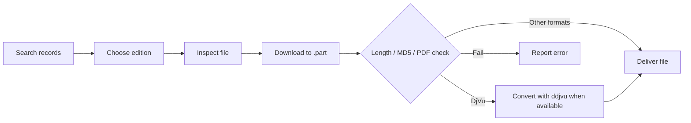

# Anna's Archive Ferry · 安娜书渡

**From choosing the right edition to receiving a usable file: a local workflow for agents and the command line.**

Search Anna's Archive records, compare editions, inspect file metadata, and save the item you select. Downloads validate the catalog MD5. With `ddjvu` installed, a downloaded DjVu can be converted to PDF automatically.

[中文](README.md) · [Skill instructions](SKILL.md) · [CLI reference](docs/cli.en.md) · [Troubleshooting](docs/troubleshooting.en.md)

[](https://github.com/ATP24/annas-archive-ferry/actions/workflows/ci.yml) [](pyproject.toml) [](LICENSE)


> **Scope:** This local Agent Skill and Python CLI uses public site pages and download routes. It is not an official Anna's Archive client and does not make the site's download route faster. Only obtain material you are permitted to access.

## Why use it instead of downloading from the website?

The website works well for an occasional manual download. This project helps when you need to **compare editions, delegate repeatable steps to an agent, and check that the saved file is usable**.

| Manual friction | What this project adds |
| --- | --- |
| Many results with different editions and formats | A structured list of titles, formats, source metadata, and catalog MD5 for your selection |
| File size or link availability becomes clear only after several clicks | A probe of the resolved link and server-reported size, with explicit failures |
| Interrupted transfers leave uncertain files | Resumption when supported, then length and catalog MD5 checks before delivery |
| DjVu needs a separate conversion step | Automatic DjVu-to-PDF conversion when `ddjvu` is present, followed by a PDF readability check |
| Agents cannot reliably parse page and progress text | Pure JSON stdout for `search` and `probe`, plus observed download progress |

It still uses the site's access and download routes. It cannot bypass site limits or guarantee a successful download. Its value is the repeatable local flow from search to verification and optional conversion.

## Features and workflow

| Step | Result | Command |
| --- | --- | --- |
| Search | Compare title, format, source metadata, and catalog MD5 | `search` |
| Inspect | Resolve a link and read the server's file size without a sample download | `probe` |
| Download | Observe actual speed and remaining time; resume and validate the file | `download` |
| Convert | Generate a PDF after downloading DjVu, retaining the original | `download` + `ddjvu` |



Downloads run **synchronously**. Probe does not guess a completion time; once the download starts, remaining time is updated from observed transfer speed and may change.

## Quick start

Requires **Python 3.9+**. Search and link resolution also require Chrome, Edge, or Playwright Chromium. **Automatic DjVu-to-PDF conversion** separately requires `ddjvu`; if unavailable or conversion fails, the original DjVu is retained.

```bash
git clone https://github.com/ATP24/annas-archive-ferry.git
cd annas-archive-ferry
python -m venv .venv
```

Activate the virtual environment: `.venv\Scripts\Activate.ps1` in Windows PowerShell, or `source .venv/bin/activate` on macOS/Linux. Then run in the same terminal:

```bash
python -m pip install -e .
python -m playwright install chromium
annas-ferry doctor
```

You can usually skip Chromium installation if a compatible Chrome or Edge is available. Doctor checks the site over the network.

Choose a record, then replace `<MD5>` with its **complete 32-character MD5**:

```bash
annas-ferry search "Pride and Prejudice Jane Austen" --ext epub --limit 5 --json
annas-ferry probe --md5 YOUR_32_CHARACTER_MD5 --json
annas-ferry download --md5 YOUR_32_CHARACTER_MD5 --output "./downloads"
```

With `--json`, stdout contains only JSON; progress and diagnostic messages go to stderr. See the [CLI reference](docs/cli.en.md) for all options.

## Agent Skill

Place the entire repository in your agent's supported skills directory with `SKILL.md` at the skill root, and install Python dependencies in the environment used by that agent. You can then ask it to compare editions before downloading, or to download a selected DjVu and convert it to PDF when `ddjvu` is available. Skill discovery, command permissions, and directory conventions depend on the agent.

## Verification and limits

- With a catalog MD5, the file is checked against it. PDFs are also opened and checked for pages. Other formats are not checked for content quality.
- DjVu-to-PDF conversion uses `ddjvu`. File size and image representation may change; lossless conversion and preservation of searchable text are not guaranteed.
- Downloads use `.part` and `.part.meta` files. Resumption requires a valid byte-range response; the final file appears only after validation.
- `--direct-url` accepts public HTTPS URLs. Without an MD5, a server-provided length is required; this is weaker than a content hash.
- Site layout, challenges, mirrors, and CDNs can change. The tool reports failures and does not guarantee access to any item.
- `doctor --fix` installs Python packages. Use it only when you intend to change the environment. Follow applicable laws and access rights.

## Docs and project status

[CLI and configuration](docs/cli.en.md) · [Troubleshooting](docs/troubleshooting.en.md) · [Live verification record](docs/verification.en.md) · [Contributing](CONTRIBUTING.md) · [Issues](https://github.com/ATP24/annas-archive-ferry/issues/new/choose) · [Security](SECURITY.md) · [MIT License](LICENSE)

The project is in **Beta**. Automated tests cover download validation, resumption, and JSON output. A past live-site test does not guarantee future compatibility.
