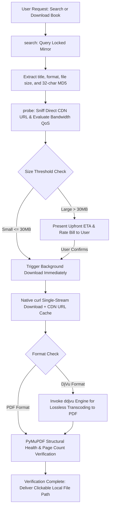

<div align="center">

# 🚢 Anna's Archive Ferry (安娜书渡)

**Automated Retrieval, Smart Disambiguation, Offline Neural Captcha Solving, and Silent Streaming Ferry Engine for Tens of Millions of Books**

[](https://github.com/ATP24/annas-archive-ferry/actions/workflows/ci.yml)
[](LICENSE)
[](https://www.python.org/)
[](SKILL.md)
[](https://github.com/ATP24/annas-archive-ferry)
[](https://github.com/ATP24/annas-archive-ferry)

[中文说明文档](README.md) · [Agent Skill Specification (SKILL.md)](SKILL.md) · [Report an Issue](https://github.com/ATP24/annas-archive-ferry/issues)

</div>

---

## 📖 Overview

**Anna's Archive Ferry (安娜书渡)** is an industrial-grade automated book retrieval and delivery suite engineered specifically for **AI Coding & Research Agents** (Google Antigravity, Claude Code, Cursor, OpenAI Codex) as well as autonomous scholars.

It systematically eliminates common bottlenecks encountered when retrieving large-scale academic literature from shadow libraries:
- 🛡️ **Zero-Cost Anti-DDoS Bypass**: Handles security challenges seamlessly using a lightweight local neural network (`ddddocr`), requiring no external paid captcha solving services.
- 🔒 **Mirror Pinning & Self-Healing**: Locks onto a designated primary domain to preserve session cookies, with automatic fallback discovery via official GitHub Pages beacons.
- ⏱️ **Probe-First Strategy**: Sniffs direct CDN URLs to calculate precise file sizes and download ETAs upfront before initiating transfers.
- 🌊 **Native Single-Stream Engine**: Leverages native curl pipelines with strict RFC 7233 range validation (`HTTP 206` vs `HTTP 200`), preventing payload corruption.
- 📄 **Lossless DjVu Transcoding**: Integrates `ddjvu` pipelines to automatically convert `.djvu` documents into high-quality PDFs, verified with `PyMuPDF`.
- 🍃 **Zero-Token Daemon Workflow**: Prevents context token exhaustion in AI agents by relying on asynchronous event wakeups rather than polling loops.

---

## 🏗️ Architecture & Delivery Workflow



---

## ✨ Feature Comparison Matrix

| Feature | Generic Downloaders / Basic Scripts | 🚢 Anna's Archive Ferry |
| :--- | :--- | :--- |
| **Mirror Resiliency** | Drifts across random mirrors, losing session cookies | **Pinned Primary Mirror** with automatic GitHub beacon recovery |
| **Pre-Download Decision** | Downloads blindly, risking timeouts on 500MB+ files | **Probe-First Protocol**: Inspects exact bytes, rate limit QoS, and ETA |
| **Captcha Handling** | Halts on DDoS-Guard challenges | **Local Neural OCR (`ddddocr`)** solves challenges offline in milliseconds |
| **Agent Context Preservation**| Consumes tens of thousands of tokens polling progress | **Zero-Token Daemon**: Asynchronous wakeups without polling |
| **Payload Integrity** | Corrupts data by appending on `HTTP 200` | **Strict RFC 7233 checks** + PyMuPDF document validation |
| **DjVu Format Support** | Raw .djvu file only or naive file extension rename | **Native `ddjvu` pipeline** automatically converts to valid PDF |
| **Cross-Platform Delivery** | Tailored to single OS | **PEP 517 CLI**, **Windows Batch**, and **macOS/Linux Shell Scripts** |

---

## 🚀 Quick Start

### Mode 1: As an Agent Skill (Recommended)

This repository natively adheres to the **Agent Skill Specification**.

1. Clone this repository into your Agent's skills directory:
   ```bash
   git clone https://github.com/ATP24/annas-archive-ferry.git "<path-to-your-skills>/annas-archive-ferry"
   ```
2. Install dependencies:
   ```bash
   cd annas-archive-ferry
   pip install -r requirements.txt
   ```
3. Prompt your AI Agent (Antigravity, Claude Code, etc.):
   > *"Search and download the PDF for 'Origin of Species' via Anna's Archive Ferry"*

---

### Mode 2: Standard Python Command Line Tool (CLI)

```bash
# 1. Clone repository
git clone https://github.com/ATP24/annas-archive-ferry.git
cd annas-archive-ferry

# 2. Install editable package
pip install -e .

# 3. Perform diagnostic self-check
annas-ferry doctor

# Auto-fix missing dependencies if needed:
annas-ferry doctor --fix
```

#### CLI Command Reference

```bash
# Search books
annas-ferry search "Origin of Species" --limit 5
annas-ferry search "Quantum Computing" --ext pdf --limit 5
annas-ferry search "Machine Learning" --json

# Probe book details and generate upfront bandwidth bill
annas-ferry probe --md5 <BOOK_MD5>

# Single-stream download
annas-ferry download --md5 <BOOK_MD5>
annas-ferry download --md5 <BOOK_MD5> --output "~/Books" --name "MyBook"
annas-ferry download --md5 <BOOK_MD5> --quiet
```

---

### Mode 3: Interactive Scripts

- **Windows**: Double-click `一键配置环境.bat` to set up and `启动安娜书渡.bat` to launch.
- **macOS / Linux**:
  ```bash
  chmod +x setup.sh run.sh
  ./setup.sh   # Run environment configuration
  ./run.sh     # Launch interactive console
  ```

---

## ⚙️ Configuration & Isolation

Runtime data and dynamic configuration updates are completely decoupled from package source code and stored in the user's home directory (`~/.annas_ferry/`):

- **User Config**: `~/.annas_ferry/config.json`
- **Cached Direct URLs**: `~/.annas_ferry_cache/<md5>.url`

```json
{
  "primary_mirror": "https://zh.annas-archive.gl",
  "official_fallbacks": [
    "https://annas-archive.gl",
    "https://annas-archive.pk",
    "https://annas-archive.gd"
  ],
  "beacons": [
    "https://shadowlibraries.github.io/DirectDownloads/AnnasArchive/",
    "https://open-slum.pages.dev/"
  ],
  "heavy_threshold_mb": 30,
  "proxy": "auto",
  "default_download_dir": "~/Downloads/AnnasFerry",
  "default_format": "pdf",
  "auto_convert_djvu": true,
  "timeout_seconds": 180,
  "headless": true
}
```

---

## 🛡️ Agent SOP & Operational Iron Rules

1. **Strict Probe-First**: Always execute `probe` prior to calling `download`. If the file exceeds 30MB, provide the user with the exact size, rate limits, and estimated download duration.
2. **Zero-Token Daemon**: Launch background downloads via non-blocking shell processes and yield immediately. Never poll `status` in a loop.
3. **Clean Output**: Suppress raw HTML DOM responses, urllib3 warnings, and verbose progress streams from the model's context window.
4. **RFC 7233 Compliance**: Only append data if `HTTP 206 Partial Content` is explicitly returned. If `HTTP 200 OK` is returned, overwrite safely.

---

## 🤝 Contributing

Contributions are welcome! Please review [CONTRIBUTING.md](CONTRIBUTING.md) for branch naming, coding style, and testing guidelines.

---

## 📜 License

Distributed under the [MIT License](LICENSE). Please use responsibly in accordance with applicable laws and fair use policies.
