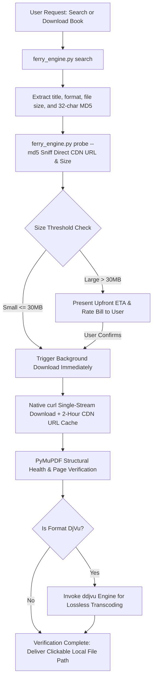

<div align="center">

# 🚢 Anna's Archive Ferry (安娜书渡)

**Automated Retrieval, Smart Disambiguation, Offline Neural Captcha Solving, and Silent Streaming Ferry Engine for Tens of Millions of Books**

[](LICENSE)
[](https://www.python.org/)
[](SKILL.md)
[](https://github.com/ATP24/annas-archive-ferry)
[](https://github.com/ATP24/annas-archive-ferry)

[中文说明文档](README.md) · [Agent Skill Specification (SKILL.md)](SKILL.md) · [Report an Issue](https://github.com/ATP24/annas-archive-ferry/issues)

</div>

---

## 📖 Overview

**Anna's Archive Ferry (安娜书渡)** is a robust, production-grade automated book retrieval and delivery suite engineered specifically for **AI Coding & Research Agents** (Google Antigravity, Claude Code, Cursor, OpenAI Agents) as well as autonomous researchers.

It eliminates common bottlenecks when accessing academic literature and shadow libraries:
- 🛡️ **Anti-DDoS Bypass**: Handles security challenges seamlessly with local lightweight OCR neural networks (`ddddocr`), requiring zero paid captcha solving services.
- 🔒 **Mirror Pinning & Self-Healing**: Locks onto a designated primary domain to avoid redirection loops, with automatic fallback discovery via official GitHub Pages beacons.
- ⏱️ **Probe-First Strategy**: Sniffs direct CDN URLs to calculate precise file sizes and download ETAs upfront before initiating transfers.
- 🌊 **Native Single-Stream Engine**: Leverages native curl pipelines with strict RFC 7233 range validation (`HTTP 206` vs `HTTP 200`).
- 🍃 **Zero-Token Daemon Workflow**: Prevents context token exhaustion in AI agents by relying on asynchronous event wakeups rather than polling loops.

---

## 🏗️ Architecture & Workflow



---

## ✨ Key Features

| Feature | Generic Downloaders / Basic Scripts | 🚢 Anna's Archive Ferry |
| :--- | :--- | :--- |
| **Mirror Resiliency** | Drifts across random mirrors, losing session cookies | **Pinned Primary Mirror** with automatic GitHub beacon recovery |
| **Pre-Download Decision** | Downloads blindly, risking timeouts on 500MB+ files | **Probe Protocol**: Inspects exact bytes, rate limit QoS, and ETA |
| **Captcha Handling** | Halts on DDoS-Guard challenges | **Local Neural OCR (`ddddocr`)** solves challenges offline in milliseconds |
| **Agent Context Preservation**| Consumes tens of thousands of tokens polling progress | **Zero-Token Daemon**: Asynchronous wakeups without polling |
| **Payload Integrity** | Corrupts data by appending on `HTTP 200` | **Strict RFC 7233 checks** + PyMuPDF document validation |
| **Out-of-the-Box Setup** | Manual headless browser compilation | **Windows 1-Click Batch** + Cross-Platform CLI |

---

## 🚀 Quick Start

### 1. Installation

```bash
git clone https://github.com/ATP24/annas-archive-ferry.git
cd annas-archive-ferry
pip install -r scripts/requirements.txt
```

### 2. Environment Diagnostics (Doctor)

Verify Python environment, system browsers, proxy detection, and primary mirror connectivity:
```bash
python scripts/ferry_engine.py doctor
```

### 3. Search for Books

```bash
# Basic search (returns top 10 by default)
python scripts/ferry_engine.py search "Origin of Species" --limit 5

# Filter by format (pdf, djvu, epub)
python scripts/ferry_engine.py search "Quantum Computing" --ext pdf --limit 5

# JSON output for automated agent tooling
python scripts/ferry_engine.py search "Machine Learning" --json
```

### 4. Probe Book Details (Probe)

Inspect file size and estimated download time before downloading:
```bash
python scripts/ferry_engine.py probe --md5 <BOOK_MD5>
```

### 5. Download

```bash
# Download by MD5 (reuses cached direct URL from probe)
python scripts/ferry_engine.py download --md5 <BOOK_MD5>

# Specify custom destination directory and filename
python scripts/ferry_engine.py download --md5 <BOOK_MD5> --output "~/Books" --name "MyBook"

# Quiet mode (ideal for background agent execution)
python scripts/ferry_engine.py download --md5 <BOOK_MD5> --quiet
```

---

## ⚙️ Configuration (`scripts/config.json`)

```json
{
  "primary_mirror": "https://zh.annas-archive.gl",
  "official_fallbacks": [
    "https://annas-archive.gl",
    "https://annas-archive.pk",
    "https://annas-archive.gd"
  ],
  "beacons": [
    "https://shadowlibraries.github.io/DirectDownloads/AnnasArchive/",
    "https://open-slum.pages.dev/"
  ],
  "heavy_threshold_mb": 30,
  "proxy": "auto",
  "default_download_dir": "~/Downloads/AnnasFerry",
  "default_format": "pdf",
  "auto_convert_djvu": true,
  "timeout_seconds": 180,
  "headless": true
}
```

---

## 🛡️ Agent SOP & Iron Rules

1. **Probe First**: Always execute `probe` prior to calling `download`. If the book exceeds 30MB, provide the user with the exact size and estimated download duration.
2. **Zero-Token Daemon**: Launch background downloads via non-blocking shell processes and yield immediately. Never poll `status` in a loop.
3. **Clean Output**: Suppress raw HTML responses, urllib3 warnings, and verbose progress streams from the model's context window.
4. **RFC 7233 Compliance**: Only append data if `HTTP 206 Partial Content` is explicitly returned. If `HTTP 200 OK` is returned, overwrite safely.

---

## 🤝 Contributing

Contributions are welcome! Please review [CONTRIBUTING.md](CONTRIBUTING.md) for guidelines on branch naming, code style, and test coverage.

---

## 📜 License

Distributed under the [MIT License](LICENSE). Please use responsibly in accordance with applicable laws and fair use policies.
