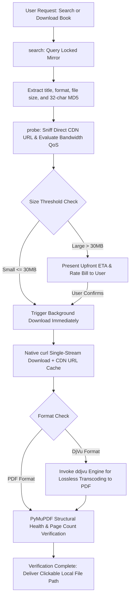

<div align="center">

# 🚢 Anna's Archive Ferry (安娜书渡)

**Automated Retrieval, Smart Disambiguation, Offline Neural Captcha Solving, and Silent Streaming Ferry Engine for Tens of Millions of Books**

[](https://github.com/ATP24/annas-archive-ferry/actions/workflows/ci.yml)
[](https://github.com/ATP24/annas-archive-ferry/releases)
[](LICENSE)
[](https://www.python.org/)
[](SKILL.md)
[](https://github.com/ATP24/annas-archive-ferry)
[](https://github.com/ATP24/annas-archive-ferry/stargazers)
[](https://github.com/psf/black)

[中文说明文档](README.md) · [Agent Skill Specification (SKILL.md)](SKILL.md) · [Report an Issue](https://github.com/ATP24/annas-archive-ferry/issues) · [Changelog (Releases)](https://github.com/ATP24/annas-archive-ferry/releases)

</div>

---

## 📑 Table of Contents

- [📖 Overview](#-overview)
- [🤖 As an Agent Skill: Triggering, Interaction & Features](#-as-an-agent-skill-triggering-interaction--features)
  - [1. 🎯 Natural Language Trigger Prompts](#1--natural-language-trigger-prompts)
  - [2. 💬 Interactive Agent Dialog Showcase](#2--interactive-agent-dialog-showcase)
  - [3. 🔌 Multi-Agent Platform Integration Guide](#3--multi-agent-platform-integration-guide)
  - [4. 🧰 Skill Core Capabilities & Tool Mapping](#4--skill-core-capabilities--tool-mapping)
- [🏗️ Architecture & Delivery Workflow](#️-architecture--delivery-workflow)
- [✨ Feature Comparison Matrix](#-feature-comparison-matrix)
- [🚀 Advanced Usage: CLI & Python SDK](#-advanced-usage-cli--python-sdk)
  - [Mode 1: Standard Python Command Line Tool (CLI)](#mode-1-standard-python-command-line-tool-cli)
  - [Mode 2: Python SDK Programmatic Usage](#mode-2-python-sdk-programmatic-usage)
  - [Mode 3: Interactive Scripts](#mode-3-interactive-scripts)
- [⚙️ Configuration & Isolation](#️-configuration--isolation)
- [🛡️ Agent SOP & Operational Iron Rules](#️-agent-sop--operational-iron-rules)
- [❓ Frequently Asked Questions (FAQ)](#-frequently-asked-questions-faq)
- [🤝 Contributing](#-contributing)
- [⚖️ Legal Disclaimer](#️-legal-disclaimer)
- [📜 License](#-license)

---

## 📖 Overview

**Anna's Archive Ferry (安娜书渡)** is an industrial-grade automated book retrieval and delivery suite engineered specifically for **AI Coding & Research Agents** (Google Antigravity, Claude Code, Cursor, OpenAI Codex) as well as autonomous scholars.

It systematically eliminates common bottlenecks encountered when retrieving large-scale academic literature from shadow libraries:
- 🛡️ **Zero-Cost Anti-DDoS Bypass**: Handles security challenges seamlessly using a lightweight local neural network (`ddddocr`), requiring no external paid captcha solving services.
- 🔒 **Mirror Pinning & Self-Healing**: Locks onto a designated primary domain to preserve session cookies, with automatic fallback discovery via official GitHub Pages beacons.
- ⏱️ **Probe-First Strategy**: Sniffs direct CDN URLs to calculate precise file sizes and download ETAs upfront before initiating transfers.
- 🌊 **Native Single-Stream Engine**: Leverages native curl pipelines with strict RFC 7233 range validation (`HTTP 206` vs `HTTP 200`), preventing payload corruption.
- 📄 **Lossless DjVu Transcoding**: Integrates `ddjvu` pipelines to automatically convert `.djvu` documents into high-quality PDFs, verified with `PyMuPDF`.
- 🍃 **Zero-Token Daemon Workflow**: Prevents context token exhaustion in AI agents by relying on asynchronous event wakeups rather than polling loops.

---

## 🤖 As an Agent Skill: Triggering, Interaction & Features

The primary identity of this repository is an **industrial-grade Agent Skill**.  
Once mounted into your AI assistant or agent workflow, you never need to remember underlying terminal commands—interact directly using natural conversational language.

### 1. 🎯 Natural Language Trigger Prompts

You can trigger the skill in any chat interface by simply stating your literature intent:

| Scenario | Natural Language Prompt Examples | Agent Background Execution |
| :--- | :--- | :--- |
| **Book Search & Disambiguation** | • *"Check what editions of 'Origin of Species' exist on Anna's Archive"*<br>• *"Search for a high-res PDF of 'The Art of Computer Programming'"*<br>• *"Look for an EPUB format of this book under 50MB"* | Invokes `search` engine, parses metadata, file formats, sizes, and returns structured comparison table with MD5s |
| **Pre-Download Bandwidth Probe** | • *"Check how large Volume 1 is and how long it will take to download"*<br>• *"Probe the direct link and speed QoS for MD5: `7f9b8c...`"* | Invokes `probe` pre-flight sensor, inspects CDN headers, and outputs upfront ETA & rate bill |
| **Automated Ferry & Transcoding** | • *"Download edition #1 and save it to my Downloads folder"*<br>• *"Directly download MD5: `a1b2c3d4...`"*<br>• *"If the downloaded file is a DjVu, convert it to PDF for me"* | Invokes `download` streaming pipeline, bypasses captchas, downloads silently, and converts DjVu to PDF |
| **Diagnostics & Auto-Healing** | • *"Run health check on Anna's Archive Ferry and test mirror connectivity"*<br>• *"Fix missing dependencies for Anna's Archive Ferry automatically"* | Invokes `doctor --fix` to verify system browsers, proxies, and automatically installs missing packages |

---

### 2. 💬 Interactive Agent Dialog Showcase

Here is the authentic end-to-end conversation flow when paired with Google Antigravity or Claude Code:

```text
👤 User: 
   I need to study ancient Chinese bibliographies. Search Anna's Archive for 'Zhao Wanli Works' and download Volume 1.

🤖 Agent (auto-activating annas-archive-ferry skill):
   Querying primary locked mirror for: 'Zhao Wanli Works'...
   Found 3 matching editions:
   --------------------------------------------------------------------------------
   [01] | PDF  | 42.6 MB  | Zhao Wanli Works Vol 1 Collation & Academic Papers (Zhonghua)
        Details: Published 2008 | Modern Typeset | Clean 300 DPI scan
        MD5: 7f9b8c3e12a4567890abcdef12345678
   [02] | DJVU | 38.1 MB  | Zhao Wanli Works Vol 1 Facsimile Colophons Collection
        Details: Raw manuscript scan | Monochrome high contrast
        MD5: 8a7b6c5d43e210fedcba098765432101
   [03] | PDF  | 152.0 MB | Zhao Wanli Works Complete 5-Volume Ultra-HD Edition
        Details: Heavy file | Includes full-color rubbing plates
        MD5: 9c8b7a6d5e4f3a2b1c0d9e8f7a6b5c4d
   --------------------------------------------------------------------------------
   Recommended: Edition [01]. Probing direct CDN stream and bandwidth rate bill...

   ================================================================================
     【Anna's Archive Ferry】Pre-Flight Decision & Bandwidth Bill
   ================================================================================
     File Name: Zhao_Wanli_Works_Vol_1.pdf
     Exact Size: 42.6 MB (44,668,928 bytes)
     Range Support: bytes (Resumable)
     Channel QoS: ~45 to 60 KB/s (Public Free Route)
     Estimated Duration: ~13.8 minutes
   ================================================================================
   ⚠️ Notice: File exceeds 30MB threshold. Initiating zero-token background daemon. 
   Confirm to start download?

👤 User: 
   Confirmed, please download.

🤖 Agent:
   Native streaming ferry initiated in background.
   Context token consumption during download is exactly 0. You may proceed with other tasks.
   Upon completion, PyMuPDF will verify document integrity and return the clickable file path.
   (Agent ends turn immediately without wasteful polling loops...)

   ~~~~~~~~~~~~~~~~ 13 minutes later (OS event wakeup triggers Agent) ~~~~~~~~~~~~~~~~

🤖 Agent:
   🎉 《Zhao Wanli Works Vol 1》has been delivered successfully!
   - Local Path: file:///C:/Users/夏虫/Downloads/AnnasFerry/Zhao_Wanli_Works_Vol_1.pdf
   - Verification: Passed (42.6 MB, 542 valid pages, document healthy)
   Click the link above to view your document.
```

---

### 3. 🔌 Multi-Agent Platform Integration Guide

| Agent Platform | Installation / Mount Path | Triggering Behavior |
| :--- | :--- | :--- |
| **Google Antigravity** | Clone to `~/.gemini/config/skills/annas-archive-ferry` or workspace `.agents/skills/` | Automatic zero-config activation upon book/literature queries |
| **Claude Code (Anthropic)** | Clone to `~/.claude/skills/annas-archive-ferry` | Automatically recognized and loaded on launch |
| **Cursor / Windsurf / Cline** | Place in `.cursor/skills/` or project `.agents/skills/` | Prompt directly in Composer or invoke via `@annas-archive-ferry` |
| **OpenAI Codex / Custom Agents** | Call `scripts/ferry_engine.py` with `--json` flag | Machine-readable pure JSON output compatible with any Function Calling schema |

---

### 4. 🧰 Skill Core Capabilities & Tool Mapping

```text
       ┌───────────────────────────────────────────────────────────┐
       │             🚢 Anna's Archive Ferry (安娜书渡)             │
       └─────────────────────────────┬─────────────────────────────┘
                                     │
     ┌──────────────────┬────────────┴───────┬──────────────────┐
     ▼                  ▼                    ▼                  ▼
【1. Search】          【2. Probe】          【3. Ferry】       【4. Self-Healing】
  search              probe                download             doctor
 • Disambiguation    • Sniff exact bytes  • Native single stream• Host browser probe
 • Formats & sizes   • Bandwidth QoS bill • Neural captcha bypass• Proxy auto-match
 • Structured MD5    • Calculate ETA mins • ddjvu lossless conv • One-click pip fix
 • Pure JSON stream  • 2-hr direct cache  • PyMuPDF verification• Beacon failover
```

---

## 🏗️ Architecture & Delivery Workflow



---

## ✨ Feature Comparison Matrix

| Feature | Generic Downloaders / Basic Scripts | 🚢 Anna's Archive Ferry |
| :--- | :--- | :--- |
| **Mirror Resiliency** | Drifts across random mirrors, losing session cookies | **Pinned Primary Mirror** with automatic GitHub beacon recovery |
| **Pre-Download Decision** | Downloads blindly, risking timeouts on 500MB+ files | **Probe-First Protocol**: Inspects exact bytes, rate limit QoS, and ETA |
| **Captcha Handling** | Halts on DDoS-Guard challenges | **Local Neural OCR (`ddddocr`)** solves challenges offline in milliseconds |
| **Agent Context Preservation**| Consumes tens of thousands of tokens polling progress | **Zero-Token Daemon**: Asynchronous wakeups without polling |
| **Payload Integrity** | Corrupts data by appending on `HTTP 200` | **Strict RFC 7233 checks** + PyMuPDF document validation |
| **DjVu Format Support** | Raw .djvu file only or naive file extension rename | **Native `ddjvu` pipeline** automatically converts to valid PDF |
| **Cross-Platform Delivery** | Tailored to single OS | **PEP 517 CLI**, **Windows Batch**, and **macOS/Linux Shell Scripts** |

---

## 🚀 Advanced Usage: CLI & Python SDK

### Mode 1: Standard Python Command Line Tool (CLI)

```bash
# 1. Clone repository
git clone https://github.com/ATP24/annas-archive-ferry.git
cd annas-archive-ferry

# 2. Install editable package
pip install -e .

# 3. Perform diagnostic self-check
annas-ferry doctor

# Auto-fix missing dependencies if needed:
annas-ferry doctor --fix
```

#### CLI Command Reference

```bash
# Search books
annas-ferry search "Origin of Species" --limit 5
annas-ferry search "Quantum Computing" --ext pdf --limit 5
annas-ferry search "Machine Learning" --json

# Probe book details and generate upfront bandwidth bill
annas-ferry probe --md5 <BOOK_MD5>

# Single-stream download
annas-ferry download --md5 <BOOK_MD5>
annas-ferry download --md5 <BOOK_MD5> --output "~/Books" --name "MyBook"
annas-ferry download --md5 <BOOK_MD5> --quiet
```

---

### Mode 2: Python SDK Programmatic Usage

Integrate Anna's Archive Ferry directly into your Python scripts or custom agent pipelines:

```python
from annas_archive_ferry import search_books, probe_book, download_book, run_doctor

# 1. Self-check environment
if not run_doctor():
    print("Dependencies missing!")

# 2. Search books
results = search_books("Origin of Species", ext="pdf", limit=3)
if results:
    target_md5 = results[0]["md5"]
    print(f"Selected: {results[0]['title']} ({results[0]['size']})")

    # 3. Upfront bandwidth and ETA probe
    bill = probe_book(target_md5)
    print(f"Size: {bill['size_mb']} MB, ETA: {bill['estimated_minutes']} mins")

    # 4. Stream download and verify
    file_path = download_book(
        md5=target_md5,
        output_dir="~/Downloads/Books",
        custom_filename="Origin_of_Species"
    )
    print(f"Book delivered successfully: {file_path}")
```

---

### Mode 3: Interactive Scripts

- **Windows**: Double-click `一键配置环境.bat` to set up and `启动安娜书渡.bat` to launch.
- **macOS / Linux**:
  ```bash
  chmod +x setup.sh run.sh
  ./setup.sh   # Run environment configuration
  ./run.sh     # Launch interactive console
  ```

---

## ⚙️ Configuration & Isolation

Runtime data and dynamic configuration updates are completely decoupled from package source code and stored in the user's home directory (`~/.annas_ferry/`):

- **User Config**: `~/.annas_ferry/config.json`
- **Cached Direct URLs**: `~/.annas_ferry_cache/<md5>.url`

```json
{
  "primary_mirror": "https://zh.annas-archive.gl",
  "official_fallbacks": [
    "https://annas-archive.gl",
    "https://annas-archive.pk",
    "https://annas-archive.gd"
  ],
  "beacons": [
    "https://shadowlibraries.github.io/DirectDownloads/AnnasArchive/",
    "https://open-slum.pages.dev/"
  ],
  "heavy_threshold_mb": 30,
  "proxy": "auto",
  "default_download_dir": "~/Downloads/AnnasFerry",
  "default_format": "pdf",
  "auto_convert_djvu": true,
  "timeout_seconds": 180,
  "headless": true
}
```

---

## 🛡️ Agent SOP & Operational Iron Rules

> [!IMPORTANT]
> **Rule 1: Strict Probe-First**  
> Always execute `probe` prior to calling `download`. If the file exceeds 30MB, provide the user with the exact size, rate limits, and estimated download duration.

> [!TIP]
> **Rule 2: Zero-Token Daemon**  
> Launch background downloads via non-blocking shell processes and yield immediately. Never poll `status` in a loop.

> [!NOTE]
> **Rule 3: Clean Output**  
> Suppress raw HTML DOM responses, urllib3 warnings, and verbose progress streams from the model's context window.

> [!WARNING]
> **Rule 4: RFC 7233 Compliance**  
> Only append data if `HTTP 206 Partial Content` is explicitly returned. If `HTTP 200 OK` is returned, overwrite safely.

---

## ❓ Frequently Asked Questions (FAQ)

<details>
<summary><b>Q1: How do I install the ddjvu transcoding tool?</b></summary>

`ddjvu` is part of the open-source `DjVuLibre` package, used to convert DjVu files to PDF losslessly:
- **Windows**: Install [DjVuLibre for Windows](https://sourceforge.net/projects/djvulibre/) and add its folder to PATH;
- **macOS**: Install via Homebrew: `brew install djvulibre`;
- **Linux (Ubuntu/Debian)**: Install via APT: `sudo apt-get install djvulibre-bin`.

*If `ddjvu` is not installed, the original `.djvu` file will be delivered safely without corruption.*
</details>

<details>
<summary><b>Q2: Why do large file downloads take longer?</b></summary>

Anna's Archive enforces a QoS bandwidth limit (around 40 ~ 70 KB/s) on free, public download routes.  
This is precisely why Anna's Archive Ferry incorporates the **Probe-First Decision** and **Zero-Token Daemon** workflow, allowing large files to download in the background without tying up human attention or wasting AI context tokens.
</details>

<details>
<summary><b>Q3: Do I need to solve DDoS-Guard captchas manually?</b></summary>

**No.** Anna's Archive Ferry embeds an offline neural OCR classifier (`ddddocr`) that takes element screenshots and passes security challenges automatically in milliseconds.
</details>

<details>
<summary><b>Q4: How do I configure a custom network proxy?</b></summary>

By default, `"auto"` scans standard proxy ports (`7890`, `10808`, etc.) and system environment variables.  
To specify a custom proxy, edit `~/.annas_ferry/config.json` and set `"proxy": "http://127.0.0.1:YOUR_PORT"`.
</details>

---

## 🤝 Contributing

Contributions are welcome! Please review [CONTRIBUTING.md](CONTRIBUTING.md) for branch naming, coding style, and testing guidelines.

---

## ⚖️ Legal Disclaimer

> [!CAUTION]
> This project is distributed under the MIT License for **academic research, educational purposes, digital humanities scholarship, and open-source architecture exploration only**.  
> The project does not host, store, or distribute copyrighted book contents or digital media, nor does it operate mirror infrastructure. All downloads are initiated directly by the end-user. Users are solely responsible for adhering to applicable copyright laws and fair use regulations in their jurisdiction.

---

## 📜 License

Distributed under the [MIT License](LICENSE). Copyright (c) 2026 ATP24.
