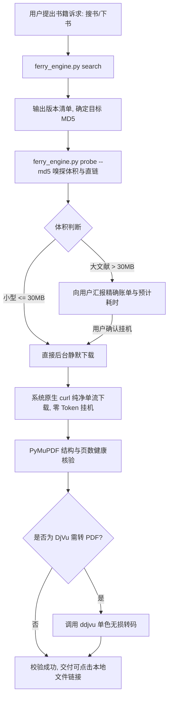

# 安娜书渡 (Anna's Archive Ferry) 技能使用指南

「安娜书渡」提供了对安娜档案（Anna's Archive）数千万册文献、学术专著、古籍古本的高效检索与离线自动化下载能力。通过系统浏览器原生探针、本地离线打码神经网络（ddddocr）、流式传输与无损 DjVu 转码，实现开箱即用的图书引渡。

---

## 核心能力与工作流



---

## 常用 CLI 命令

脚本位于当前技能目录的 `scripts/ferry_engine.py`：

### 1. 环境诊断与自愈 (Doctor)
```bash
python scripts/ferry_engine.py doctor
# 缺失依赖时自动修复:
python scripts/ferry_engine.py doctor --fix
```

### 2. 检索书籍与多版本对比 (Search)
```bash
# 基本检索（默认前 10 条）
python scripts/ferry_engine.py search "书名或关键词" --limit 5

# 指定格式检索
python scripts/ferry_engine.py search "史记" --ext pdf --limit 5

# 输出 JSON 供程序自动化解析
python scripts/ferry_engine.py search "书名" --json
```

### 3. 前置探测体积与挂机耗时 (Probe - 核心前置步骤)
在任何下载前，先嗅探直链获取精确字节大小与预计下载时长：
```bash
python scripts/ferry_engine.py probe --md5 <MD5码>

# 输出 JSON 供程序自动化解析:
python scripts/ferry_engine.py probe --md5 <MD5码> --json
```
*注：Probe 成功后会自动将抓取到的 CDN 直链缓存 2 小时，后续 `download` 命令无需重复排队等待，直接复用直链！*

### 4. 纯净单流下载 (Download)
```bash
# 通过书籍 MD5 码直接下载（优先复用 probe 缓存直链）
python scripts/ferry_engine.py download --md5 <MD5码>

# 静默挂机下载（推荐后台任务使用，零干扰日志）
python scripts/ferry_engine.py download --md5 <MD5码> --quiet

# 指定保存目录与自定义文件名
python scripts/ferry_engine.py download --md5 <MD5码> --output "~/Downloads/AnnasFerry" --name "自定义书名"
```

---

## Agent 交互铁律（严格遵守）

1. **铁律一：先探后下（必须执行 Probe 前置决策）**：
   对于任何下载需求，严禁直接盲目拉取。必须先调用 `probe` 嗅探文件真实大小。
   - 若文件 **<= 30 MB**：自动启动下载，两分钟内完成交付；
   - 若文件 **> 30 MB**：必须向用户呈现实时账单（书名、精确 MB、通道限速约 50KB/s、预计耗时分钟数），获得知情后再启动挂机。
2. **铁律二：零 Token 挂机（严禁高频 Polling）**：
   后台下载通过系统命令启动后，Agent 必须立即告知用户“已启动后台静默挂机”并**直接结束回合**！
   **严禁在循环中频繁调用状态轮询**。必须完全交由系统异步事件通知自动唤醒，挂机期间上下文 Token 消耗必须为 0！
3. **铁律三：严禁回传未经清洗的原始 HTML 与密集日志**：
   严禁将网页原始 DOM、数百行 urllib3 警告或重复的进度字节回传到对话上下文，保持 Agent 上下文清爽。
4. **铁律四：严格区分 HTTP 206 与 200**：
   只有服务端明确返回 `206 Partial Content` 且字节范围对齐时才允许追加断点续传；若返回 `200 OK`，坚决以覆盖模式拉取，杜绝数据拼接损坏。
